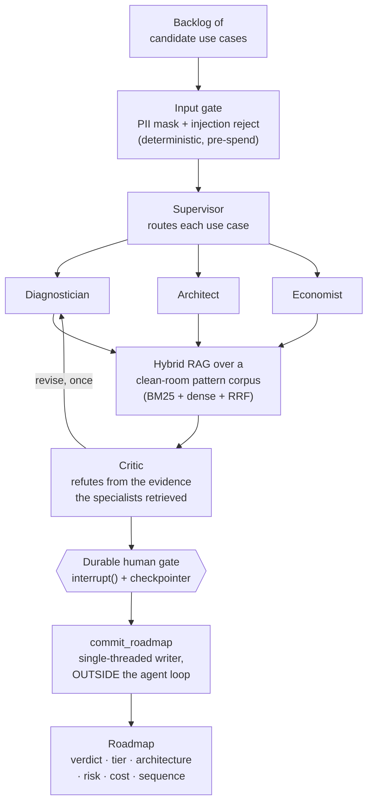

# authority-ladder

[](https://github.com/nickbiird/authority-ladder/actions/workflows/ci.yml)

<!-- DEMO — drop your two Kap recordings into docs/ (demo.gif = free recorded demo, demo-live.gif = live run); set the live URL after the Vercel deploy. -->


<sub>**▶ The free "Run recorded demo" above** replays a real committed run client-side — no key, zero model calls. **Below: the live "Run triage" path** running the real graph on Claude.</sub>


**▶ Try it for free.** The **Run recorded demo** button replays a *real* committed run entirely client-side — **no API key, zero model calls** — so you can watch the full backlog → per-item triage → durable approval gate → committed roadmap without spending a cent. The live "Run triage" path runs the real graph with your own key. **[Live demo →](https://authority-ladder.vercel.app)** _(URL set after deploy)_

**Drop a backlog of candidate AI use cases in plain language; get back a defended, priced, prioritized transformation roadmap — per use case: an AI-or-not verdict, a place on the autonomy ladder, a defended architecture, an EU-AI-Act risk tier, and a cost-per-task — each one adversarially reviewed and held behind a durable human gate before anything commits. For cents, in seconds, with the eval scorecard published.**

Triage, not a transformation mandate. That distinction is load-bearing and repeated throughout.

## The problem it solves

The 2026 enterprise-AI question has moved. It is no longer "can AI assist?" — assistance is a solved baseline — it is **"where do we grant AI the authority to *act*?"** Most firms now run pilots (adoption is high), yet most see no earnings impact and fewer than one in ten scale, and the reason is overwhelmingly **organizational, not technical**: the wrong use cases get funded, the right ones get over- or under-automated, and "should this thing be allowed to act on its own?" is answered by vibes in a steering deck.

A transformation lead holds a backlog: a support copilot, a churn model, an "AI dashboard," a CV screener, an autonomous refund agent. Each one is a different *kind* of problem with a different right answer and a different safe level of autonomy — and getting the autonomy wrong is the expensive error (an over-automated irreversible action is the failure that makes the news). The costly question is not "can we build it?" It is **"which of these deserve the build, at what level of autonomy, and in what order?"** That is a triage problem, and triage is what this tool does — a cited, defended first-pass on each use case so the transformation budget goes where the value is. The one use case it correctly flags as "this isn't AI, it's a SQL view" pays for every over-engineering it prevents.

## What it does



For each use case in the backlog:

1. A deterministic **input gate** masks personal data and rejects instruction-injection payloads before any model spend.
2. A **supervisor** routes the use case to the full pipeline, a diagnosis-only pass, or reject.
3. Three **isolated specialists** — a **Diagnostician** (AI-or-not + autonomy tier + risk tier), an **Architect** (the defended reference architecture), and an **Economist** (cost-per-task + ROI) — each retrieve only their slice of a clean-room pattern corpus, so no specialist's context is polluted. They only read; they never act.
4. A **Critic** tries to refute the verdict **from the evidence the specialists actually retrieved** — not a fresh search — and forces at most one grounded revision.
5. The run **pauses on a durable, checkpointed `interrupt()`**. Nothing is published until a human approves; with Postgres configured, the pause survives a restart, a redeploy, and a fresh serverless invocation.
6. Only after approval does a **single-threaded writer**, in its own node **outside the agent loop**, commit the roadmap: verdict, autonomy tier, architecture (with its 3-2-1), risk tier + obligations, cost, and a scale-or-stall sequence, ordered now → next → later → don't-build.

The same engine is exposed as an **MCP server** (`/api`, streamable HTTP): any MCP client (Claude, Cursor, another agent) can call `retrieve_pattern`, `get_pattern`, and `diagnose_use_case`. The MCP draft is explicitly **ungated** — a synchronous tool call cannot park on a human approval — so the tool stamps its output `ungated_draft: true` instead of faking parity with the web flow. (The tool *is* the autonomy ladder eating its own dogfood: an MCP call is a draft surface, never an act one.)

## The three classifications, and the one that matters most

| Classification | Values | How it's scored |
|---|---|---|
| **AI-or-not** | none · classical ML · one LLM call · RAG · agent | exact-match. ~⅓ land on `none`; saying "this is a SQL view, not AI" is the credibility move. |
| **Autonomy tier** | suggest · draft · act-with-approval · act | scored as a **ceiling**: passes iff the recommended tier never exceeds what cost-of-error permits. Over-granting authority is the failure that matters. |
| **Risk tier** | prohibited · high · limited · minimal (EU AI Act) | one lightweight governance input — not a compliance product (see the sibling repo below). |

The autonomy ceiling is **deterministic code, not a prompt** (`lib/ladder.ts`): a high-cost-of-error, irreversible action can never be clamped to full autonomy, even if the model argues for it. That clamp is a CI-gated safety property.

## The numbers

Every number is read from a committed artifact in `evals/results/`, regenerated by `npm run evals*`, and gated in CI. See **[TRUST_REPORT.md](TRUST_REPORT.md)** and `/evals` in the app.

The golden set is **24 labelled use cases**, split on purpose: **16 core** (labels fall near-deterministically out of the AI-or-not gate and the AI Act tier families) and **8 contested** (Article 6(3) derogation edges, the act/act-with-approval boundary, the RAG-vs-long-context line), labelled against a published rubric ([`evals/golden/RUBRIC.md`](evals/golden/RUBRIC.md)). Accuracy is reported **per split** because they mean different things: core measures the system; contested measures agreement with one documented reading of genuinely arguable text. Conflating those two numbers is how a transformation demo lies.

The **classification scorecard** (recorded live on Claude — Haiku 4.5 fast / Sonnet 4.6 deep — committed to `evals/results/`):

| Split | n | AI-or-not | Risk tier | Cost-ceiling (GATED) | Autonomy vs rubric | Answer-judge |
|---|---|---|---|---|---|---|
| core | 16 | **75.0%** | 56.3% | **100.0%** | 100.0% | 93.8% |
| contested | 8 | 50.0% | 75.0% | **100.0%** | 75.0% | 87.5% |

Read this honestly, because the honesty is the point. The **cost-ceiling is 100%** because it is the *deterministic safety invariant* — code, not a model behaviour (the `autonomyCeiling` clamp), and the one thing that must never fail. **Core AI-or-not is 75%** on a hard, adversarially-labelled set — which is the *right* range: a system that scored ~100% would mean the golden set was too easy ([the appreciating-skill literature](https://github.com/nickbiird) targets ~70%). **Contested is 50%** by design — those are genuinely arguable cases (e.g. "auto-approve refunds under €50" → the model calls it `none` because it's a threshold *rule*, disagreeing with the `single_llm` label; both readings are defensible). **Risk-tier is the weakest dimension (56% core)** — the model over-classifies toward `limited`; it is a *lightweight governance input* here, not the headline (the deep version is the sibling `ai-act-triage`). Every miss is printed with the model's own reasoning in the eval output — nothing is hidden or tuned away.

**Cost: €0.128 per use case** (155 metered calls, real token traces) → a 24-case backlog for **~€3.07**. A 40-item backlog ≈ €5. It prices the triage decision, not the build.

The **retrieval scorecard** (committed, all three legs):

| Config | Recall@5 | MRR |
|---|---|---|
| bm25-only (the no-key CI gate) | 69.2% | 0.842 |
| dense-only | 66.7% | 0.668 |
| **hybrid (the live default)** | **71.8%** | **0.847** |

Hybrid is the *measured* winner, not an assumed one — pattern names are terms-of-art (BM25 territory), use-case descriptions are paraphrase (dense territory), and fusing genuinely helps on this corpus. (On the sibling `ai-act-triage`'s corpus the same scorecard showed dense winning and the default flipped — the point is the measurement decides, not the belief.) Dense/hybrid were recorded with a Gemini embeddings key; the live app runs reasoning on Claude with BM25 retrieval unless a Gemini key is present.

## Run it

```bash
git clone https://github.com/nickbiird/authority-ladder && cd authority-ladder
npm ci

# Works with NO API key (committed corpus, deterministic paths):
npm test                  # unit gates: corpus, retrieval, PII rail, autonomy ladder
npm run evals:retrieval   # BM25 retrieval scorecard (the CI gate)
npm run evals:probes      # input-rail + structural-containment security gate
npm run evals -- --replay # replay gate (no-op until you record fixtures)

# Full pipeline — pick a reasoning provider (Anthropic is the default):
cp .env.example .env      # add ANTHROPIC_API_KEY (LLM_PROVIDER=anthropic, the default)
                          #   ...or set LLM_PROVIDER=google + GOOGLE_API_KEY
npm run dev               # http://localhost:3000

# Dense/hybrid retrieval is OPTIONAL and Google-only (Anthropic has no embeddings
# API). With a GOOGLE_API_KEY, enable it once; without one, retrieval is BM25-only:
npm run ingest:embed      # one-off: static dense embeddings (costs a fraction of a cent)

# Reproduce / publish the numbers:
npm run evals -- --record && npm run evals:retrieval && npm run evals:probes
npm run trust-report
```

Optional: set `DATABASE_URL` (Neon/Supabase free tier) to make the approval gate durable. Without it the gate works but is in-memory — a restart loses pending approvals, the UI says so, and that printed degradation is the point.

## Stack, with the alternative each choice rejected

| Layer | Choice | Rejected alternative, and when it flips |
|---|---|---|
| Orchestration | **LangGraph.js** `StateGraph`: a fixed graph; the model-made decisions are the route, the verdicts, and whether the critique sustains | A free ReAct agent. Triage has a known procedure; an agent that *might* diagnose loses to a pipeline that *always* does. Flips if the task becomes open-ended research. |
| Topology | **Supervisor → 3 isolated read-side specialists** | One mega-prompt (loses context isolation + per-component evals); **parallel write-agents** (rejected outright — ~⅓ coordination-tax territory; single-threaded-writer law). Flips to a bigger supervisor on tool sprawl, never to parallel writers. |
| Arbitration | **Proposer + binary critic** grounded on captured evidence, one revision max (graph-enforced) | Single-shot verdicts (ship unexamined readings); a numeric 1-5 judge (drifts). Flips to no-critic only for low-stakes batch triage. |
| The write | **Single-threaded `commit_roadmap`, outside the loop, behind a durable gate** | The write as a tool the agent can call (breaks lethal-trifecta containment); an in-memory approval prompt (dies with the process, no audit). Flips never — this is the architecture, not a TODO. |
| Retrieval | **Hybrid (BM25 + dense, RRF)** over a clean-room pattern corpus, measured | Dense-only (flips if the scorecard shows BM25 net-negative *here*, as it did for the sibling repo); GraphRAG (flips for multi-hop, with the token-cost caveat said in the same breath). |
| HITL | **`interrupt()` + Postgres checkpointer**: durable pause, approve later, audit artifact | An in-process prompt with a timeout. Dies with the process and a silent timeout manufactures false confidence. |
| Models | **Provider-agnostic + tiered** (`LLM_PROVIDER`): Anthropic (Haiku 4.5 fast / Sonnet 4.6 deep) or Gemini (Flash / Pro). Cheap tier routes/diagnoses/prices/judges; deep tier architects/critiques. temperature 0 on eval-asserted paths | One frontier model everywhere (2–4× the cost for no measured gain on routing); fine-tuning (the knowledge is in the corpus, and the corpus changes by re-ingest, not retraining). The reasoning provider and the embeddings provider are decoupled — only Google offers embeddings, so dense retrieval is Google-only; Anthropic-only runs degrade to BM25 (measured at 69.2%). |
| Hosting | **Vercel free tier**, SSE streaming, checkpoint-resume across invocations | A persistent VPS. The free-tier constraint forces the durable-checkpoint design to be real instead of decorative. |
| Evals | **Golden set + per-component scorers in CI** (retrieval recall, classification match, autonomy-ceiling, injection probes) | LLM-as-judge for the headline numbers — judges drift and flatter; every *gated* metric here is deterministic. The answer-judge is reported, labelled as judged. |

## Vendor decoder

Enterprise agent platforms sell these same boxes under proprietary names. Primitives outlive product names:

| This repo | Generic primitive | Typical enterprise-platform name |
|---|---|---|
| `StateGraph` + conditional edges | Graph/DAG orchestration | Orchestrator, Flow/Super agents |
| Supervisor + isolated specialists | Multi-agent supervisor topology | Agent teams, multi-agent orchestration |
| Critic node | LLM-as-judge / evaluation agent | Evaluation agents |
| `interrupt()` + checkpointer | Durable human-in-the-loop | Human agents, approval flows |
| `commit_roadmap` outside the loop | Single-threaded writer / action gate | Tool-execution guardrail |
| `/api` MCP server | Model Context Protocol (open standard) | Tool/connector catalogs |
| Golden set + CI gates | Eval harness with regression gates | Quality/eval suites |

The buy-vs-build decision is which boxes you rent, which you own, and where your data is allowed to sit while they run.

## What I'd add next

- **Recorded assessment fixtures committed** (the `--record` run) so the classification gate activates in CI — top of the list.
- A demo GIF / Loom once the live deployment is up.
- A real NER PII masker (Presidio-class) behind the same boundary; the regex rail is the placement argument, not the end state.
- A cross-encoder reranker after RRF once a model is installable, for a larger corpus where RRF isn't already saturated.
- Live verification of the Postgres durable-gate path (the seam is wired and env-gated; it falls back to memory until exercised against a real DB).

## Honesty card

- Built solo; the contested-split labels are one documented reading, and the rubric is published so you can disagree precisely. The disclosed bias is toward caution — for a triage tool, over-routing to human review is the correct asymmetry.
- The corpus is **synthetic, vendor-neutral enterprise-AI knowledge** — no client data, no PII, fully open-sourceable. The adoption statistics it encodes ("most pilots don't scale," "value needs process redesign") are directional industry findings, used as triage heuristics, not quoted precision.
- Costs are derived from real token traces, never estimated; an estimate the model produces is labelled as one.
- This is triage, not a transformation roadmap to execute unread. The human gate exists for exactly that reason.

---

Built by [Nicholas Bird](https://github.com/nickbiird), ESADE Business & AI. Related work: [ai-act-triage](https://github.com/nickbiird/ai-act-triage) (the deep EU-AI-Act version of the risk-tier box — read-only classification), [icp-radar](https://github.com/nickbiird/icp-radar) (client-side semantic search over 3,756 EU startups), [mcp-ai-workspace](https://github.com/nickbiird/mcp-ai-workspace) (self-hosted LLM workspace with MCP tooling). This repo is the multi-agent, write-enabled layer of that stack: a supervisor over isolated specialists, a critic, a durable human gate, and the one irreversible action contained outside the loop.
